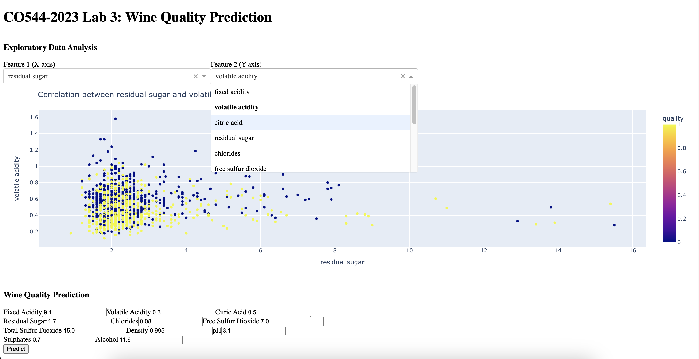

# Lab 3: Interactive Python Dashboards

This lab is developed parallel to the CO 544 Machine Learning and Data Mining course at the Department of Computer Engineering, University of Peradeniya, Sri Lanka. The purpose of this lab is to provide hands-on experience in building interactive dashboards using Python to provide a visual representation of complex data in an intuitive and interactive way.

## Lab Overview

The lab consists of the following key components:
1. **Dataset:** The dataset used in this lab is the [Wine Quality Red Dataset](data/winequality-red.csv), which contains physicochemical and sensory properties of red wine samples, along with their quality rating. The dataset contains 1,599 instances with 11 input features and one output variable (quality), ranging from 0 to 10.
2. **Data Preprocessing:** The dataset is preprocessed by removing duplicates, dealing with missing values, and converting the quality rating to a binary classification problem of "good" and "bad" wines based on a threshold value. The preprocessed dataset is then split into training and testing sets.
3. **Machine Learning Model:** A logistic regression model is trained on the preprocessed dataset to predict the quality of wine based on the given feature values.
4. **Performance Evaluation:** The model is evaluated on the testing set using various performance metrics such as accuracy, precision, recall, F1-score, ROC curve, and AUC.
5. **Dashboard:** A dashboard is created using the Python Dash library to visualize the correlation matrix and predict the wine quality with the given feature values.

## Getting Started
To run the dashboard locally, follow the steps below:

1. Clone this repository to your local machine.
2. Install the required dependencies using the `requirements.txt` file.

```
pip install -r requirements.txt
```

3. Open the terminal and navigate to the project directory.
4. Run the Jupyter notebook `main.ipynb`.
5. Follow the instructions in the notebook to start the server.
6. Once the server is running, open your web browser and navigate to the address displayed in the notebook to access the dashboard.

**Note:** The experiment is done using Jupyter notebook. The `main.ipynb` file is the file that needs to be run using Jupyter Notebook.

## Deploying the Dashboard
To deploy the dashboard on a cloud platform such as [Render](https://render.com/), follow the instructions provided in the [Deploying a Dash Application on Render](https://github.com/thusharabandara/dash-app-render-deployment) repository.




**Figure 1.** Screenshot of the dashboard developed using Python Dash, displaying the correlation of two selected features and providing predictions for wine quality based on user input.